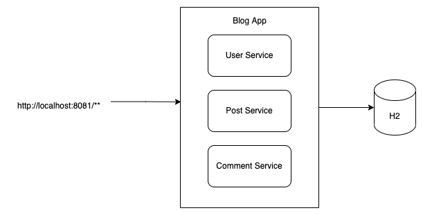
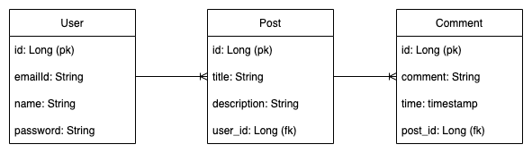
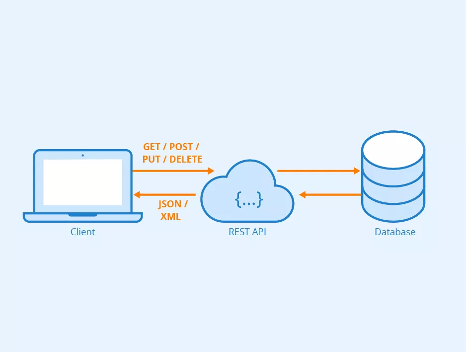

# Blog App Monolith

Endpoint 
>  http://localhost:8081/

H2 Console 
>  http://localhost:8081/h2-console

## Architecture Diagram

## ER Diagram

## REST Architecture

### References
* REST Documentation - https://restfulapi.net/
* Spring Boot Documentation - https://docs.spring.io/spring-boot/docs/current/reference/htmlsingle/
* Java 8 - https://www.baeldung.com/java-8-new-features
* Stream API - https://www.baeldung.com/java-8-streams
* Exception Handling - https://springframework.guru/exception-handling-in-spring-boot-rest-api/
* Logging - https://www.slf4j.org/manual.html

### Other Repos

* https://github.com/Deloitte/DynamoDB-REST-APIs-Example.git
* https://github.com/Deloitte/Blog-App-Monolith.git
* https://github.com/Deloitte/Blog-App-Microservices.git
* https://github.com/Deloitte/Blog-App-Microservices-API-Gateway.git
* https://github.com/Deloitte/Blog-App-Microservices-Unit-Integration-Testing.git
